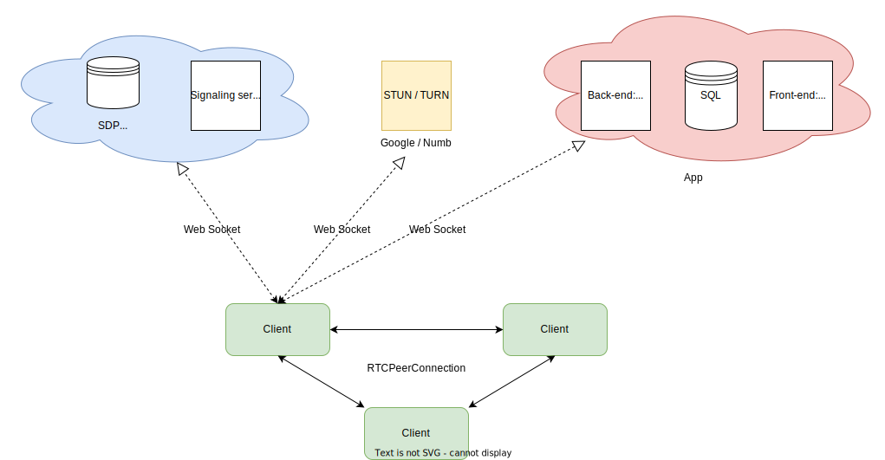

# Zoom'eirb a P2P Video Conferencing project

This project is a peer-to-peer video conferencing application that utilizes WebRTC for real-time communication, a Node.js server with Socket.io for signaling, and a frontend built with Node.js and Pug.

## Context
RTCPeerConnection is a WebRTC API that allows two browsers to communicate directly with each other without the need for a centralized server. It is used to establish a peer-to-peer connection between two devices, allowing them to share video, audio, and data.

The RTCPeerConnection API provides a way for the client-side JavaScript code to create, configure and manage peer-to-peer connections. When two clients want to establish a connection, each client creates an RTCPeerConnection object, exchange information about the media and network configuration and then use this object to send and receive media.

Once the connection is established, you can start sending and receiving data using the createOffer and createAnswer methods, and by setting the remoteDescription property.

It's important to note that the RTCPeerConnection API requires the use of a signaling server to exchange information needed to establish the connection, such as IP addresses and ports. In this project we are using a Node.js server with Socket.io for signaling.

It is also important to be familiar with the concepts of STUN and TURN servers and how they are used in WebRTC to ensure that the connection is successful.

You can read more about the RTCPeerConnection API and its usage on the following link:
https://developer.mozilla.org/en-US/docs/Web/API/RTCPeerConnection

You can read more about signaling servers and how they are used in WebRTC on the following link :
https://developer.mozilla.org/en-US/docs/Web/API/WebRTC_API/Signaling_and_video_calling

You can read more about STUN and TURN servers and how they are used in WebRTC on the following links :

https://developer.mozilla.org/en-US/docs/Web/API/WebRTC_API/STUN_and_TURN_servers
https://tools.ietf.org/html/rfc5389

## Project Architecture



The architecture of the project can be broken down into 3 main components:

1. Client-side: This component is responsible for handling the user interface and the WebRTC functionality. It consists of the frontend code, which is written in JavaScript and uses the RTCPeerConnection API to establish a peer-to-peer connection with another client. It also uses pug as a template engine to generate the HTML pages.

2. Signaling server: This component is responsible for relaying signaling messages between clients. It is written in Node.js and uses Socket.io to handle the WebSocket connections. It also uses a database to store the information about the clients and the rooms.

3. STUN/TURN servers: These servers are used to assist with the connection establishment process. They are used to ensure that the clients are able to establish a peer-to-peer connection even if they are behind a NAT firewall. They can be either public servers or private servers that are hosted by the project itself. In this project Google STUN server and Numb TURN server are used.

The client-side and the signaling server are communicating with each other via webSocket, the signaling server is communicating with STUN/TURN servers via their APIs.

The clients connect to the signaling server, exchange information with each other through the signaling server, and use the information to establish a peer-to-peer connection.

The STUN/TURN servers are used as a fallback solution when a direct connection cannot be established.

## Communication Protocol
The Signaling server handles the followed WebSocket connections events : 

1. subscribe : using the "on" method of a socket to listen for an event named "subscribe". When the event is triggered, the callback function is executed.
Inside the callback function, the socket joins a room specified in the "data" object passed to the callback function with the join method. The socket also joins another room specified by the socketId data.socketId.It then check if the room specified by data.room exists with socket.adapter.rooms.has(data.room) and if it is true, it emits an event named "new user" to all the other members present in the room, using the to method. The event is emitted with an object containing the socketId of the user who joined the room.

2. new user : When the 'new user' event is received, it emits 'newUserStart' event to the new user (data.socketId) with the current user's socketId as sender. It also adds the new user's socketId to the pc array, which is likely an array that keeps track of all the peer connections in the room. It then calls the init_user function, passing in true as the first argument, indicating that the current user will create an offer by emitting an 'sdp' event through the socket object.

```
An offer is a description of the media session that a client is willing to establish with another client. The media session includes the types of media (audio, video, etc.) that the client is willing to receive, the codecs that the client supports, and the transport and network-level details, such as the IP addresses and ports that the client is reachable at.

In this case, the createOffer method is used to generate an offer, which is a RTCSessionDescription object. This object contains the description of the media session that the client is willing to establish with the remote peer. This offer is then set as the local description for the RTCPeerConnection object using the setLocalDescription method.

The offer is then sent to the remote peer using the emit method with the 'sdp' event, along with the partnerName and the sender's socketId. The remote peer will receive this offer, and can use it to create an answer, which is another RTCSessionDescription object that describes the media session that the remote peer is willing to establish.
```

3. newUserStart : When the 'newUserStart' event is received by the client, it adds the sender's socketId to the pc array, and calls the init_user function, passing in false as the first argument, indicating that the current user will not create an offer and data.sender as the second argument, indicating that the connection is being established with the sender.

4. sdp : This event is emitted after the local description of the peer connection has been set and it will be sent to the target user's socketId. The target user will be able to use this description to create an answer, complete the connection and establish a peer-to-peer connection with the current user.

```
An answer is a response to an offer, which is also a description of the media session that a client is willing to establish with another client. The media session includes the types of media (audio, video, etc.) that the client is willing to receive, the codecs that the client supports, and the transport and network-level details, such as the IP addresses and ports that the client is reachable at.

In this case, it seems that the code provided only shows the offer creation process and the handling of the 'sdp' event. The answer creation process would be implemented on the other peer and would typically occur after it receives the offer from the first peer.

The remote peer would use the setRemoteDescription method to set the received offer as the remote description for its RTCPeerConnection object. Then, it would use the createAnswer method to generate its own RTCSessionDescription object, which would contain the description of the media session that the remote peer is willing to establish. This answer would then be sent back to the first peer using the 'sdp' event as well.
```

Once both peers have exchanged offers and answers, they can proceed to exchange ICE candidates and establish the peer-to-peer connection.
 
5. Ice Candidate : this is the event listener for the icecandidate event on the RTCPeerConnection object, which is triggered when a new ICE candidate is found. When this event is triggered, it emits an 'ice candidates' event through the socket object,it's used to establish the peer-to-peer connection between the users.

```
ICE candidates are used by WebRTC to establish a peer-to-peer connection between clients. ICE (Interactive Connectivity Establishment) is a technique used to traverse NAT (Network Address Translation) routers and firewalls to establish a connection. Each client generates a set of ICE candidates, which are IP addresses and ports that the client can be reached at. The clients then exchange their ICE candidates, and use them to establish a connection
```

## Getting Started

These instructions will get you a copy of the project up and running on your local machine for development and testing purposes.

### Prerequisites

You will need to have Node.js and npm (Node Package Manager) installed on your system. You can download and install them from the official Node.js website: https://nodejs.org/en/

### Installation

1. Clone the repository to your local machine:

```
$ git clone https://github.com/medahalli/WebRTC.git
```
2. Navigate to the project directory:

```
$ cd WebRTC
```
3. Adding ssl to the server
```
#Create key and certificate:
openssl req -newkey rsa:2048 -new -nodes -x509 -days 3650 -keyout key.pem -out cert.pem

# Create sslcert folder and move the files there:
mkdir sslcert && mv *.pem sslcert
```
4. Install the required dependencies and launch the app:
```
$ ./install.sh
```

5. Open a web browser and go to https://localhost:8081 to access the application.

## Built With

- [WebRTC](https://webrtc.org/) - Real-time communication technology
- [Node.js](https://nodejs.org/) - JavaScript runtime
- [Socket.io](https://socket.io/) - Real-time communication library
- [Pug](https://pugjs.org/) - Templating engine for Node.js
- [autolink.js](https://github.com/bryanwoods/autolink-js) - A small (about half a kilobyte), simple, and tested JavaScript tool that takes a string of text, finds URLs within it, and hyperlinks them

## Authors

- **Fellah Hicham**
- **Ahalli Mohamed**
- **Smaili Nabil**
- **Rajae Sefrioui**
- **Lamghari Taha**

## License

This project is licensed under the MIT License 

## Acknowledgments

- Hat tip to anyone whose code was used
- Inspiration
- etc
